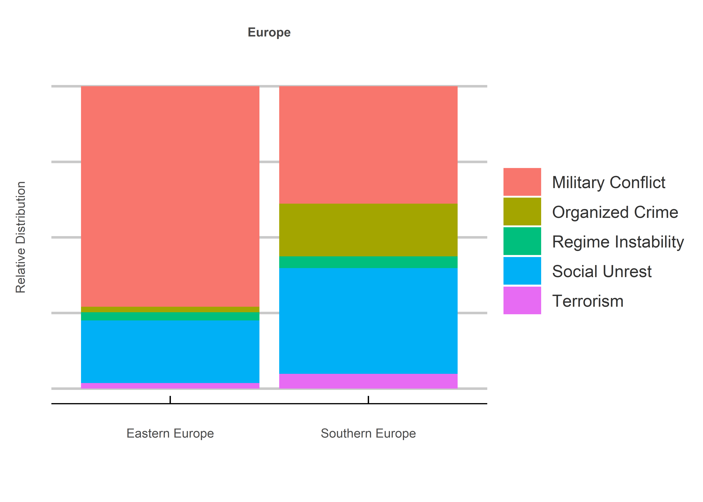
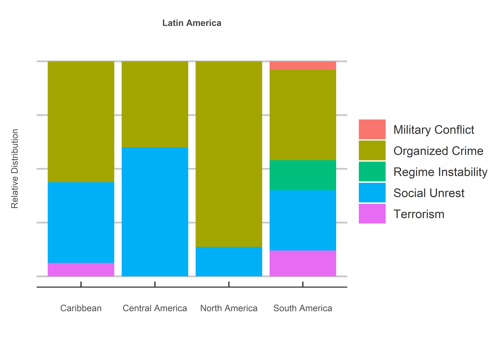

Risky Business
================
Jack Carter
2/8/2022

## **Summary**

This project uses web scraping, regex combinations and a labeling
mechanism to identify how the prevalence of political violence risks
differs by continent and region in the emerging world. It uses 193 risk
headlines from 76 unique online newspapers.

 

## **Method**

**1) Scraping:**

A database of over 250 local newspapers in the emerging world is scraped
three times a week, beginning 7 February 2022.

**2) Regex:**

A sereis of regex strings (including keywords, actor/action combinations
and hyperbolic situations) are used to create five political violence
(PV) word banks.

**3) Labeling:**

These word banks are then used to label the headlines according to five
PV risks, including military conflict, organized crime, regime
instability, social unrest and terrorism.

 

## Results

### **1) Overview:**

<!-- -->

 

### **2) Regional Focus:**

<!-- -->

<!-- -->

<!-- -->

<!-- -->

<!-- -->
